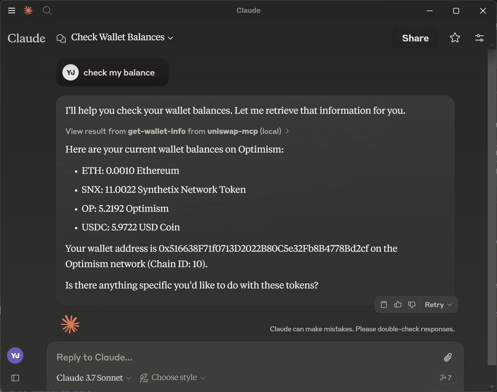

# Uniswap MCP (Model Context Protocol)

This package implements the Model Context Protocol for Uniswap using Protocolink and Moralis libraries.

⚠️ **IMPORTANT NOTICE**
This is an experimental research project:
- Do not store large amounts of funds in the generated wallet
- Use this for research and testing purposes only

## Prerequisites

- Node.js and npm installed
- Moralis API key (Sign up at [Moralis](https://moralis.io/))

## Installation

1. Install all dependencies:
```bash
npm install
```

2. Generate a new wallet:
```bash
npm run generate-wallet
```

3. Configure environment variables:
   - Refer to `.env.example` for the required environment variables format
   - Add your Moralis API key to the generated `.env` file

4. Fund your wallet for testing (on Optimism network):
   - Transfer 0.01 ETH to your generated wallet address on Optimism (for gas fees)
   - Transfer 20 USDC to your generated wallet address on Optimism (for swap testing)
   - You can check your wallet balance using `npm run get-wallet-info`

## Environment Variables

Please refer to `.env.example` for the required environment variables:
- `MORALIS_API_KEY`: Your Moralis API key
- `WALLET_PRIVATE_KEY`: Your wallet's private key (automatically generated by `npm run generate-wallet`)

## Claude Desktop Integration

To use this MCP server with Claude Desktop:

1. Build the project:
```bash
npm run build
```
This will create the server bundle at `build/index.js`

2. Open Claude Desktop settings:
   - On macOS: Click on the Claude menu and select "Settings..."
   - On Windows: Click on the Claude icon in the system tray and select "Settings..."

3. In the Settings window:
   - Click on "Developer" in the left sidebar
   - Click on "Edit Config" to open the configuration file

4. Edit the configuration file (`claude_desktop_config.json`):
   - Location on macOS: `~/Library/Application Support/Claude/claude_desktop_config.json`
   - Location on Windows: `%APPDATA%\Claude\claude_desktop_config.json`

Add the following configuration:
```json
{
  "mcpServers": {
    "uniswap": {
      "command": "node",
      "args": ["path/to/your/build/index.js"]
    }
  }
}
```
Replace `path/to/your` with the actual path to your project's build directory.

5. Restart Claude Desktop for the changes to take effect.

6. Verify the installation:
   - You should see a hammer icon in the Claude interface
   - Type "Check my balance" in Claude Desktop
   - If the MCP server is properly connected, Claude will display your wallet balance using the get-wallet-info tool



## Testing Scripts

The following scripts are available for testing the environment:

### Check Wallet Information
```bash
npm run get-wallet-info
```
Displays your wallet address and all token balances in your wallet.

### Get Token Information
```bash
npm run token-info <token-symbol>
```
Example: `npm run token-info USDC`

Retrieves detailed information about a specific token, including:
- Token name
- Contract address
- Decimals
- Chain ID
- Logo URI (if available)

### Get Quote Information
```bash
npm run quote-info <token-symbol> <amount-in> [slippage]
```
Example: `npm run quote-info OP 10 0.5`

Fetches both buy and sell quotes for a token:
- Buy quote: How much of the target token you'll receive for your USDC
- Sell quote: How much USDC you'll receive for selling the target token
- Default slippage is 0.5% if not specified

### Execute Token Swap
```bash
npm run swap-test <fromTokenSymbol> <toTokenSymbol> <amount> <slippage> [--round-trip|-r]
```
Example: 
- Simple swap: `npm run swap-test USDC OP 10 0.5`
- Round-trip swap: `npm run swap-test USDC OP 10 0.5 --round-trip`

Executes a token swap with the following features:
- Swap between any supported token pairs
- Optional round-trip mode that swaps back to the original token
- Displays detailed transaction information including exchange rates and fees
- Shows profit/loss calculation for round-trip swaps